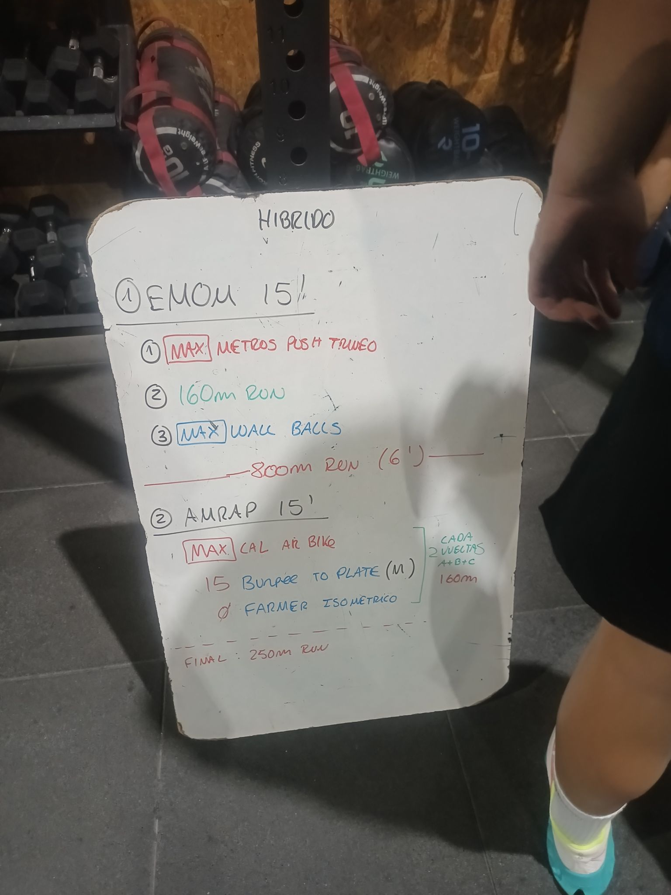

# Híbrido

## 1. EMOM 15'

Cada minuto se rota entre estos tres ejercicios (5 vueltas):

1. **MAX** metros de push de trineo
2. 160 m de carrera
3. **MAX** wall balls

## Transición: 800 m de carrera (6')

## 2. AMRAP 15'

- **MAX** calorías en air bike
- 15 burpees to plate (M)
- Farmer isométrico (Ø)

> Cada 2 vueltas (A + B + C): 160 m de carrera.

## Final: 250 m de carrera
