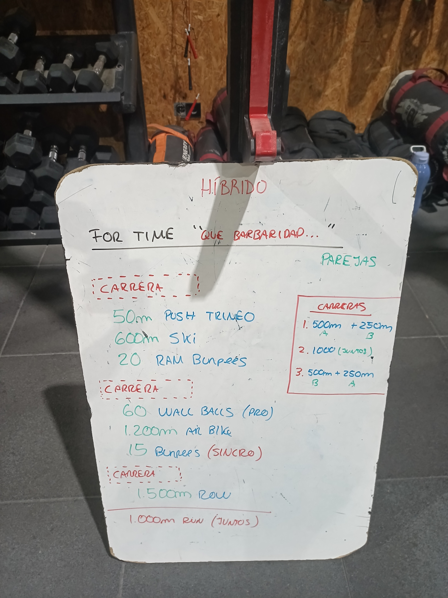

# Híbrido · 18/09/2026 — For time "¡Qué barbaridad...!" (parejas)

Por parejas (A y B), **for time**. Cada bloque empieza con una carrera.

## Carrera 1: 500 m A + 250 m B

- 50 m push de trineo
- 600 m ski
- 20 RAM burpees

## Carrera 2: 1000 m (juntos)

- 60 wall balls (pro)
- 1200 m air bike
- 15 burpees (sincro)

## Carrera 3: 500 m B + 250 m A

- 1500 m remo

## Final: 1000 m de carrera (juntos)

## Datos del reloj

| Tramo | Tiempo | Distancia | FC media / máx |
|---|---|---|---|
| 1 | 9:07 | 1,0 km | 162 / 179 |
| 2 | 9:58 | 1,0 km | 171 / 182 |
| 3 | 7:23 | 0,2 km | 170 / 184 |
| 4 (1000 m final) | 4:34 | 1,0 km | 183 / 188 |
| **Total** | **31:20** | **3,3 km** | **170 / 188** |

- Tiempo por zonas: < 150: 11 % · 150–172: 37 % · **172–185: 45 %** · > 185: 7 %.
- Comparado con el del 11/09 (43', FC 173, **22 %** por encima de 185): sesión más corta y menos tiempo en la zona roja.
